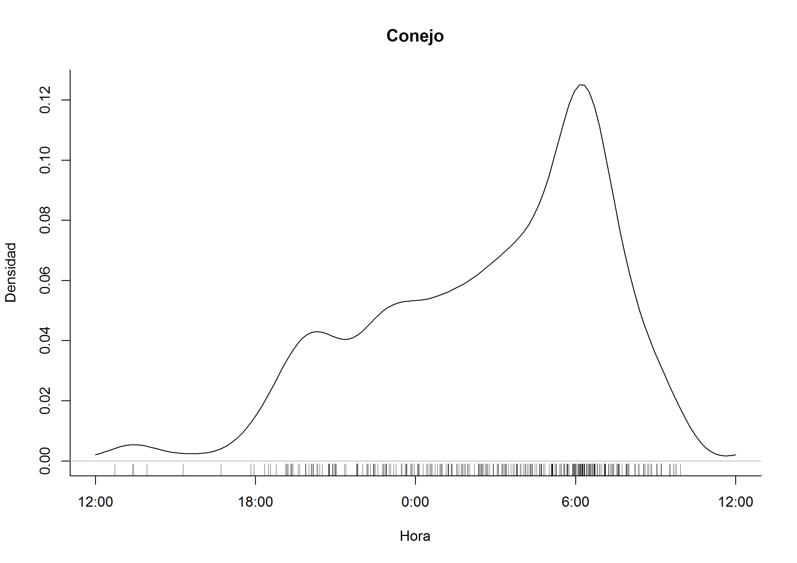
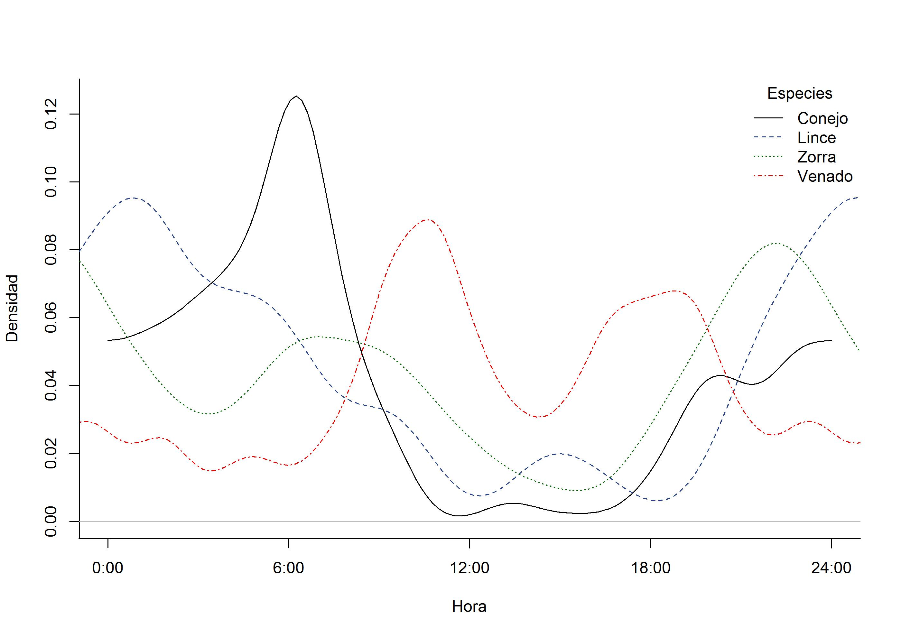

#Objetivo

En este artículo se presenta el proceso para calcular la actividad y traslape de la misma entre especies. Para este ejemplo se utilizará una base creada desde `camtrapR, la cual contiene registros de 10 cámaras colocadas en la Reserva de la Biosfera Tehuacán-Cuicatlán en el año 2012.

#Paquete R empleado

**Overlap** por Meredith y Ridout (2014)

#Para bajar el paquete y otros recursos:

<https://cran.r-project.org/web/packages/overlap/index.html>

#Introducción

Actualmente por medio de las cámaras trampa podemos describir los patrones de actividad de diferentes mamíferos medianos y grandes ya que al tomarse la foto queda grabada la fecha y hora en los metadatos. La frecuencia de foto-capturas por hora es un indicador de cuando, una especie, esta más activa y cuando tiene poca actividad, por medio de esto podemos definir si son nocturnas, diurnas, crepusculares o catemerales. 

Los patrones de actividad generalmente se grafican en histogramas o gráficas circulares utilizando las frecuencias. En el 2009 Ridout y Linkie proponen el uso de la densidad kernel para estimar el traslape entre dos patrones de actividad y en el 2014 se libera el paquete Overlap (Meredith y Ridout). Este paquete nos permite graficar los patrones de actividad de varias especies utilizando densidad kernel, podemos estimar el coeficiente de traslape (medida no paramétrica que estima el área de coincidencia bajo dos curvas de densidad (Schmid y Schmidt 2006)) entre los patrones de dos especies diferentes o de una misma especie en diferentes sitios o épocas y también estima los intervalos de confianza. 

Una de las ventajas de utilizar este paquete es que envés de agrupar las imágenes en categorias de tiempo, las utiliza como muestras aleatorias de distribución continua modelando la curva a lo largo de las horas del día. Algunas de las cosas que se deben considerar antes de usar el paquete es tener un ancho de banda adecuado ya que esto influye en la estimación del coeficiente de traslape (Delta o Dhat), se requiere tener el mayor número de registros posibles para tener una mejor estimación Dhat (por ejemplo 75 o más registros), así mismo al momento de interpretar los resultados debemos hacerlo con cautela ya que el coeficiente de traslape es solo descriptivo por lo que no se obtiene un valor de significancia (p), para esto último se deben utilizar otros análisis estadísticos (por ejemplo estadística circular).

Para este ejemplo se utilizará una base creada desde camtrap, la cual contiene registros de 10 cámaras colocadas en la Reserva de la Biosfera Tehuacán-Cuicatlán en el año 2012.

#Instalación y datos iniciales

Los primero que se debe hacer es instalar el paquete desde <https://cran.r-project.org/web/packages/overlap/index.html> o utilizar la siguiente función en R

```
install.packages("ovelap")
```

```{r, message=FALSE, warning=FALSE, include=FALSE}
library(overlap)
```

Una vez instalado el paquete, se debe crear una base en excel que contenga los registros de captura por hora. Esta base puede ser creada en excel directamente o se puede utilizar la base creada desde camtrapR. 

Antes de cargar el archivo, primero se deben transformar todas las horas de registro a números, esto se hace desde excel de la siguiente forma:

1. Se agrega una nueva columna a lado de la columna Time, como se muestra en la imagen 


2. Se copian todas las horas en la nueva columna "Time_2"

3. Se cambia el formato de la columna a "general" y automáticamente se cambian todas las horas a números decimales (en un rango de 0 a 1), este es el formato que se requiere para utilizar el paquete.


Una vez que se guardan los cambios en la base con formato *.csv, se pide a R que lea la tabla

```{r, message=FALSE, warning=FALSE}
actividad_RBTC <- read.csv("tabla registros.csv", header = T)

head(actividad_RBTC)
```

#Selección de especies, conversión a radianes y extracción de datos

Ya que se cargó la tabla, se pide a R que nos muestre las especies y el número de registros independientes obtenidos para cada una 

```{r}
summary(actividad_RBTC$Species)
```

Esto nos sirve para poder elegir que especies tienen el número de registros necesarios para obtener su patrón de actividad. Algunos autores sugieren que se necesitan mínimo 11 registros, sin embargo hay que considerar que en este paquete se sugiere tener una muestra cercana a 50 registros para poder obtener una mejor estimación de Dhat.

Una vez seleccionadas las especies con las que se va a trabajar, se procede a convertir los números decimales a radianes

```{r message=FALSE, warning=FALSE}
hora_radianes_RBTC <- actividad_RBTC$Time_2 * 2 * pi
```

Después se extraen los datos de las especies seleccionadas, para este ejemplo se seleccionaron solo aquellas que tuvieran más de 50 registros.

```{r, message=FALSE, warning=FALSE}
conejo_RBTC <- hora_radianes_RBTC [actividad_RBTC$Species == "Conejo"]

lince_RBTC <- hora_radianes_RBTC [actividad_RBTC$Species == "Lince"]

zorra_RBTC <- hora_radianes_RBTC[actividad_RBTC$Species == "Zorra"]

venado_RBTC <- hora_radianes_RBTC [actividad_RBTC$Species == "Venado"]
```


Si se quieren comparar datos entre años, épocas y/o sexos de una misma especie, se extraen los datos de la siguiente forma:

```
venado_RBTC_2012 <- hora_radianes_RBTC [actividad_RBTC$Species == "Venado" & actividad_RBTC == 2012]

venado_RBTC_2013 <- hora_radianes_RBTC [actividad_RBTC$Species == "Venado" & actividad_RBTC == 2013]

```

#Gráficas de actividad

Una vez extraidos los datos de cada especie se puede graficar el patrón de actividad de cada una por separado 

```{r}
densityPlot(conejo_RBTC, xscale = 24,  xcenter = c("noon", "midnight"), add = F,rug = T, extend = "lightgray", main = "Conejo", xlab = "Hora", ylab = "Densidad", bty = "L")

densityPlot(lince_RBTC, xscale = 24,  xcenter = c("noon", "midnight"), add = F,rug = T, extend = "lightgray", main = "Lince", xlab = "Hora", ylab= "Densidad", bty = "L") 
```


si se utiliza xcenter = "m" y extend = NULL, se obtiene la siguiente gráfica 

```{r, message=FALSE, warning=FALSE, include=FALSE}

densityPlot(conejo_RBTC, xscale = 24,  xcenter = "m", add = F,rug = T, extend = NULL, main = "Conejo", xlab = "Hora", ylab = "Densidad", bty = "L") 
```




o todas las especies en la misma gráfica 


```

densityPlot(conejo_RBTC, xscale = 24,  xcenter = c("noon", "midnight"), rug = F, extend = "lightgray", main = " ", xlab = "Hora", ylab = "Densidad", bty = "L", col = "black", lty = 1)
densityPlot(lince_RBTC, add = TRUE,rug = F, col = "royalblue4", lty = 2) densityPlot(zorra_RBTC, add = TRUE,rug = F, col = "darkgreen", lty = 3) 
densityPlot(venado_RBTC, add = TRUE,rug = F, col = "red2", lty = 4) 
legend("topright", inset= c(0,0),title = "Especies",c("Conejo", "Lince", "Zorra", "Venado"), lty = 1:4, col = c("black", "royalblue4", "darkgreen", "red2"), bty = "n")

```




#Estimación del coeficiente de traslape

El coeficiente de traslape (Dhat) es una medida no paramétrica que nos permite comparar el patrón de actividad de dos especies o el patrón de una misma especie en diferentes épocas, de diferentes sexos o edades. El valor de delta va de 0 a 1, dónde 1 = actividad igual y 0 = actividad diferente. Se recomienda consultar, Schmid y Schmidt 2006, Ridout y Linkie 2009.

Overlap estima tres Dhat: 1, 4 y 5, para seleccionar el mejor estimador se debe tomar en cuenta el tamaño de la muestra más pequeña que se va a comparar. Cuando la muestra es menor a 50 registros se utiliza Dhat1 y si es mayor a 75 se utilizá Dhat4, los autores recomiendan no utilizar Dhat5 ya que es muy inestable.

Para este ejemplo se va a comparar el patrón de actividad de conejos (presa) y zorras (predador)

```
conejo_RBTC
zorra_RBTC
```

Para decidir que Dhta utilizar podemos pedir a R que nos muestre el número mínimo de registros obtenidos con la función

```{r, echo=TRUE, message=FALSE, warning=FALSE}
min(length(conejo_RBTC), length(zorra_RBTC))
```

En este caso tomaremos como estimador a Dhat4 ya que se tienen más de 75 registros de la muestra más pequeña.

Una vez que ya se sabe que Dhat se utilizará se procede a estimarla de la siguiente forma

```{r, message=FALSE, warning=FALSE}
conejo_zorra_delta <- overlapEst(conejo_RBTC, zorra_RBTC)
conejo_zorra_delta
```

Después se puede graficar con la función:

```{r}
overlapPlot(conejo_RBTC, zorra_RBTC, main = " ", linecol = c("black", "darkgreen"), lty = c(1,3), bty = "L", xlab = "Hora", ylab = "Densidad")
legend("topright", inset = c(0,0), title = "Especies", c("Conejo", "Zorra"), lty= c(1,3), col = c("gray25", "seagreen"), bty = "n")
```

#Intervalos de confianza

También se pueden obtener los intervalos de confianza al 95% por medio de remuestreo. Para esto es necesari seguir tres pasos

1. Se utiliza la función "resample" para crear una matriz de remuestreo para cada conjunto de datos

```{r, message=FALSE, warning=FALSE}
conejo_remuestreo <- resample(conejo_RBTC, 1000)
zorra_remuestreo <- resample(zorra_RBTC, 1000)
```

2. Se usa "bootEst" para estimar el valor de Dhat de cada dato remuestreado

```{r, message=FALSE, warning=FALSE}
conejo_zorra_remuestreo <- bootEst(conejo_remuestreo, zorra_remuestreo, adjust = c(NA, 1, NA))
```

El valor de adjust dependerá de la Dhat seleccionada, los autores del paquete sugieren que se utilicé 0.8 para Dhat1, 1 para Dhat4 y 4 para Dhat5. Por ejemplo si utilizamos Dhat1 entonces queda "adjust= c(0.8, NA, NA)"

Una vez estimados todos los valores de Dhat4 se obtiene el promedio con la función

```{r, message=FALSE, warning=FALSE}
conejo_zorra_delta_remuestreo <- colMeans(conejo_zorra_remuestreo)
conejo_zorra_delta_remuestreo
```


3. Se obtienen los intervalos de confianza de la siguiente forma

```{r}
conejo_zorra_delta_remuestreo2 <- conejo_zorra_remuestreo[, 2]
bootCI(conejo_zorra_delta [2], conejo_zorra_delta_remuestreo2)
```


#Conclusiones

Consideramos que Overlap es un paquete eficiente para graficar los patrones de actividad y  estimar el traslape. Algunas de sus ventajas son que se pueden utilizar las tablas creadas desde camtrap o tablas creadas en Excel solo modificando el formato de hora, no es necesario agrupar los registros por intervalos de hora, ya que se utilizan todos los registros continuos. También se pueden estimar intervalos de confianza y se pueden utilizar argumentos de la función plot para editar las gráficas (col, lty, lwd, xlab, ylab y/o main). 

Algunas de las limitaciones del paquete son que se requiere (preferentemente) una muestra de 75 o más registros, es neceario establecer el ancho de banda adecuado para tener una estimación confiable del coeficiente de traslape (Dhat). Por último el coeficiente de traslape solo es descriptivo ya que no se obtiene un valor de significancia estadístico, por lo que es necesario complementar con otros análisis. 

#Bibliografía

* Meredith, M., y M. Ridout. 2014. Overlap: Estimates of Coefficient of Overlapping for Animal Activity Patterns. R package version 0.3.0. <https://CRAN.R-project.org/package=overlap>
* Ridout, M. S., y M. Linkie. 2009. Estimating overlap of daily activity patterns from camera trap data. Journal of Agricultural, Biological, and Environmental Statistics 14: 322-337. doi.org/10.1198/jabes.2009.08038
* Schmid, F., y A. Schmidt. 2006. Nonparametric estimation of the coefficient of overlapping—theory and empirical application. Computational Statistics and Data Analysis 50: 1583-1596.
