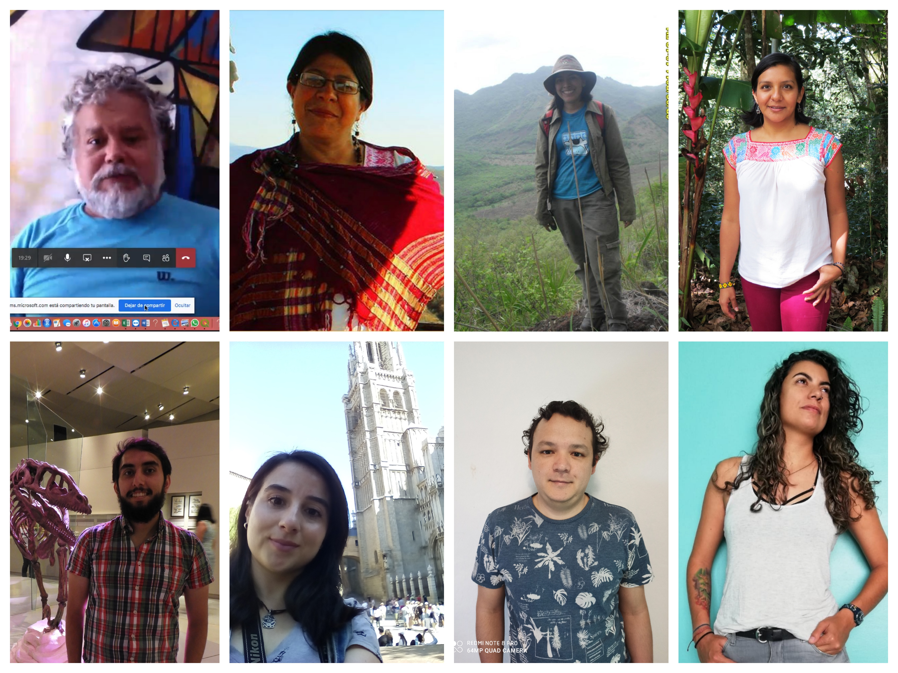
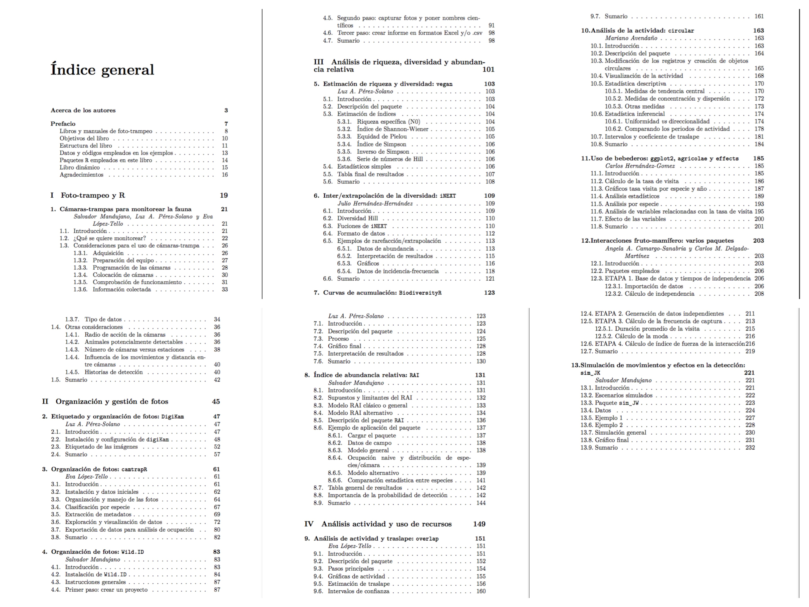

# Fototrampeo en R: Organización y análisis de datos, Volumen I


### Antes que nada agradecerles la adquisción del libro y la participación en nuestros talleres. 



### Esperamos sea de mucha utilidad en sus proyectos...!

# Talleres

### Próximos

- “FototrampeoR”, **PROXIMAMENTE SE ANUNCIARÁN**, 1er semestre 2023.

### Pasados

- “FototrampeoR”, XIV Congreso de Mastozoología de la AMMAC, Chihuahua, 13 al 15 Octubre 2022.

- “FototrampeoR: Modelado de Captura-Recaptura Espacialmente Explícita (SECR)”, BUAP, 5-15 Agosto 2022. 

- “FototrampeoR: Modelado de Ocupación”, BUAP 1-5 Julio 2022. 

- “FototrampeoR: Hábitat-Fauna en R_SIG”, BUAP, Puebla, 1 al 4 Junio 2022. 

- “FototrampeoR: Análisis de Diversidad”, BUAP, Puebla, 21 al 30 Abril 2022. 

- “FototrampeoR: Organización y Análisis de Datos”, BUAP, Puebla, 25 Marzo al 2 Abril 2022.

- “Fototrampeo en R”, Congreso Colombiano de Mastozoología, Colombia, Noviembre 2021.

- “FototrampeoR: Organización y Análisis de Datos”, BUAP, Puebla, 27 Agosto al 4 Septiembre 2021.

- “FototrampeoR: Análisis de Diversidad”, BUAP, Puebla, 28 Mayo al 5 Junio 2021. 

- “FototrampeoR: Modelado de Ocupación”, BUAP, Puebla, 23 Septiembre al 10 Octubre 2020. 

- “FototrampeoR: Organización y Análisis de Datos”, BUAP, Puebla, 20 al 24 Julio 2020.

- “FototrampeoR: Organización y Análisis de Datos”, BUAP, Puebla, 22 al 26 Junio 2020.

- “FototrampeoR: Organización y Análisis de Datos”, UNAM, Morelia, Mich., 16 y 17 de enero de 2020.

- “FototrampeoR”, AMMAC, Chihuahua, 23 al 25 Noviembre 2019.

- “FototrampeoR”, Instituto de Ciencias Biológicas, Universidad de Ciencias y Artes de Chiapas, Tuxtla Gutierrez, Chis. 26 y 27 Noviembre 2018.

- “FototrampeoR”, Benemérita Universidad Autónoma de Puebla, Pue. Noviembre 2017.


## Para adquirir el libro impreso

Si te interesa el libro en físico contáctanos en:

- <salvador.mandujano@inecol.mx>

## Para adquirir libre PDF del libro  

- <[salvador.mandujano@inecol.mx](https://www.researchgate.net/publication/348922971_Fototrampeo_en_R_Organizacion_y_Analisis_de_Datos_Volumen_I)>

## Objetivos del libro

El libro *Foto-trampeo en R* tiene los siguientes objetivos:

1. Organizar las fotos de manera más eficiente y sencilla. 

2. Aplicar diferentes programas y paquetes R.

3. Analizar la información para diferentes objetivos como: estimar la ocupación, abundancia y densidad poblacional; la actividad y traslape; y la riqueza y diversidad de especies; y otros temas relacionados con el diseño y muestreo.

4. Conocer libros, artículos y recursos en internet sobre el foto-trampeo.

## Origen del libro

La idea del presente libro tiene tres orígenes o motivaciones:

  - El trabajo realizado en el proyecto “*Monitoreo del venado cola blanca en la Reserva de Biósfera Tehuacán-Cuicatlán*” donde hemos empleado intensivamente el foto-trampeo, además de otros métodos;

  - Los cursos de posgrado que coordinamos en el Inecol: “*Modelado de ocupación, abundancia y densidad poblacional: enfoque frecuentista y bayesiano en R y otros programas*”, y “*Modelado de las relaciones fauna-hábitat en R y SIG*”; y 

  - El taller al que hemos llamado: *Foto-trampeo en R* que hemos impartido en diferentes foros y lugares. 
  
## Usuarios potenciales

El libro *Foto-trampeo en R* está dirigido a estudiantes de ciencias biológicas, profesionales y técnicos dedicados al estudio y manejo de fauna; así como para personas con interés en actualizarse en las temáticas aquí tratadas. Si bien no hay ningún requisito previo, preferentemente los interesados deben tener nociones básicas de ecología general y conocimientos de estadística elemental. Asimismo, es deseable que tengan nociones básicas del empleo del programa R. 

En este sentido, este libro surge como una propuesta para dar a conocer y recopilar herramientas que permiten una mejor organización de la información obtenida por foto-trampeo y de paqueterías estadísticas con las cuales es posible analizar la información de acuerdo con los objetivos de estudio, como lo es R y las paqueterías asociadas. Hemos buscado crear un libro de "cabecera" para quienes desean ser más eficientes en el manejo de la información obtenida por foto-trampeo, para aquellos que inician en los análisis de esta información, y también para aquellos que ya tienen experiencia, pero quieren profundizar en los análisis clásicos y nuevos.

## Estructura del libro

El volumen I del libro *Foto-trampeo en R: organización y análisis de datos* está integrado por 13 capítulos organizados en cuatro secciones o partes.

__Parte I: Foto-trampeo y R__. En esta sección se introduce de manera general el empleo de las cámaras-trampa enfatizando tres aspectos fundamentales: ¿para qué se quiere emplear el foto-trampeo?, ¿qué aspectos generales se deben considerar para el muestreo? y ¿qué es lo que se está realmente detectando con las cámaras? 

__Parte II: Organización y gestión de fotos__. Esta sección está integrada por tres capítulos que en conjunto tratan de responder las preguntas ¿cómo organizar las miles de fotos de manera que sea sencillo etiquetarlas, almacenarlas y luego consultarlas?, ¿qué programas existen para este fin? y ¿cómo generar archivos de esta información que puedan luego emplearse en otros programas y paquetes R para el análisis numérico y estadístico? Entre las diferentes opciones, basado en nuestra experiencia, el empleo de `DigiKam` y `camtrapR` pueden ayudar a resolver de manera muy eficiente estos aspectos. Alternativamente, el programa `WildID` es muy amable y sencillo de emplear para estos mismos objetivos. 
__Parte III: Análisis de riqueza, diversidad y abundancia relativa__. Esta sección está integrada por cuatro capítulos. Para analizar la información a nivel de riqueza y diversidad, en tres capítulos se describen los paquetes `BiodiversityR`, `vegan` e `iNEXT`. Para el cálculo de los llamados índices de abundancia relativa, en el cuarto capítulo de esta sección se introduce el paquete `RAI` en desarrollo.

__Parte IV: Análisis de actividad y uso de recursos__. Esta sección está integrada por cinco capítulos. En los dos primeros se introducen los paquetes `overlap` y `circular` para analizar datos de actividad. Mientras que en los dos últimos se emplean varios paquetes como `ggplot2` un excelente graficador, `data.table`, `dplyr`, `tidyverse` y otros para procesar datos de cámaras colocadas en recursos específicos que atraen a la fauna como son los bebederos y los árboles fructificando.

## Contenido de los capítulos



## Datos y códigos empleados en los ejemplos

El presente libro está concebido como una guía práctica donde se introduce el empleo de varios paquetes `R`. Para esto, empleamos un conjunto de datos modificados de nuestros proyectos de investigación. Es importante mencionar que el libro no se enfoca en la interpretación o reportar los resultados de casos de estudio particulares, sino que emplea un conjunto de esos datos para ejemplificar el empleo de los diferentes paquetes. En este sentido, el lector podrá bajar el archivo `.zip` que contiene todos los datos y los códigos de cada uno de los capítulos. Además, en las carpetas se incluyen las figuras a color publicadas en escalas de grisis en la versión impresa del libro. Se sugiere visitar el repositorio del libro en `GitHub` en la siguiente dirección:

<https://github.com/SMandujanoR/Foto-trampeo-R-Vol_I> 

Luego donde dice `Clone or download` bajar el `.zip`. Una vez que esté en su computador, se sugiere crear un proyecto en `RStudio` con todos los capítulos, o bien un proyecto por capítulo. 


En este repositorio encontrarán todo el Material Suplementario (códigos R, .csv, imágenes) necesario para ejectuar los ejemplos del libro. El material está organizado en carpetas que corresponden a cada capítulo del libro Foto-trampeo en R: Vol I. 

  1) Se sugiere que se clone y bajen todos los capítulos como .ZIP
  2) Luego crear un proyecto RStudio (.Rproj) ya sea de todo el libro o bien uno por capítulo.
  3) Una vez que se tenga esto podrá ejecutarse cada código R tal como aparece en el libro.
  4) Para esto se ha incluido uno o más archivos .csv con los datos de prueba.
  5) Adicionalmente, en los capítulos se han incluido en color las figuras de cada capítulo.
  6) Se sugiere ejecute los códigos empleando los códigos R y datos aquí anexados. 
  7) Posteriormente, puede sustituir con su propios datos cada .csv para analizarlos dependiendo de los objetivos.
  8) Para instalar los paquetes que se emplean en este libro se sugiere ejecutar el código de la carpeta `instalar paquetes` o  bien copiar las siguientes líneas y ejectuarla en un nuevo *script* o código:

```
paquetes <- c("imager", "vegan", "unmarked", "secr", 
"agricolae", "wiqid", "SPACECAP", "jagsUI", "iNEXT", 
"BiodiversityR", "overlap", "circular", "camtrapR", 
"rgdal", "ggplot2", "PerformanceAnalytics", 
"RColorBrewer", "MASS", "MuMin",   "bibtex", "dplyr", 
"ade4", "adehabitatHR", "adehabitatLT", "agricolae", 
"akima", "boot", "chron", "dunn.test", "ggExtra", 
"ggplot2", "gtools", "jagsUI", "KernSmooth", 
"maptools", "MASS", "mgcv", "overlap", "plotrix", 
"raster", "RColorBrewer", "reshape", "rgdal", 
"rgeos", "rmarkdown", "scrbook", "secr", "sp", 
"survival", "survminer", "tree", "unmarked", 
"vegan", "wiqid", "maps", "GIStools", "WDI", 
"Scales", "shapefiles", "RgoogleMaps", "tidyverse",
"data.table", "reshape2", "effects")
  
pkgs_miss <- paquetes[!(paquetes %in% 
                        installed.packages())]
    
if(length(pkgs_miss)>0L)
      install.packages(pkgs_miss, repos = 
      "https://cloud.r-project.org/", 
                          dependencies = TRUE)
```

## Libro dinámico

El libro *Foto-trampeo en R* es un fiel reflejo de lo que tratamos de enfatizar: `R` es un excelente recurso para organizar, analizar y reportar los datos y resultados del foto-trampeo. Este libro fue escrito completamente desde `R` empleando los paquetes `RMarkdown` y `bookdown` ejecutados desde la plataforma `Rstudio`. 

## Contacto

Si encuentras algún error o tienes problemas para ejecutar algún código, no dudes en contactarnos en:

- <salvador.mandujano@inecol.mx>

### ¡Esperamos el libro sea de mucha utilidad para todos ustedes, saludos...!
